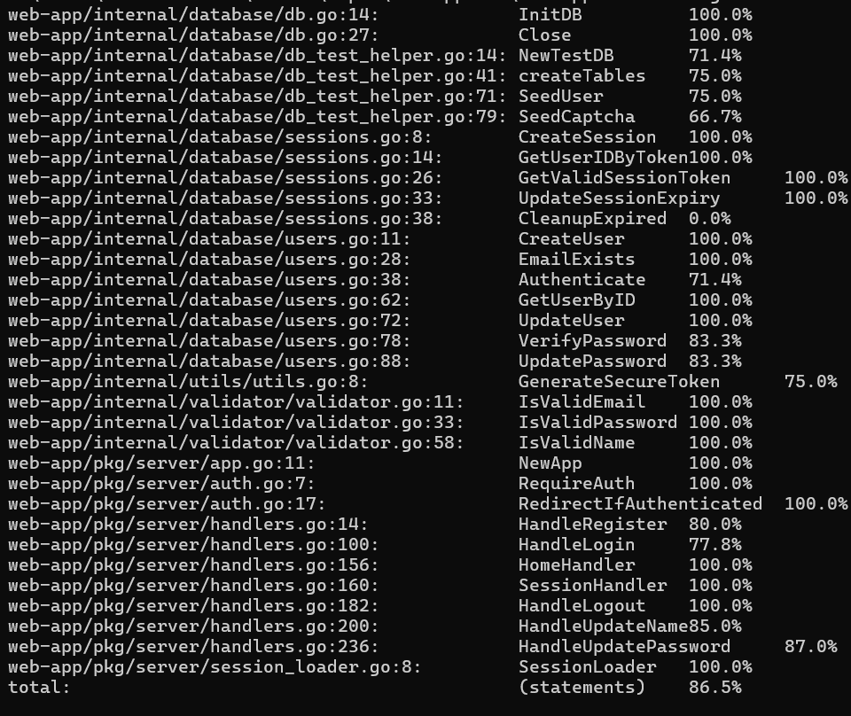

# web-app-with-auth

Уеб приложение с клиент-сървър архитектура, регистрация/вход, сесии и защитени профилни операции.

## 1) Използвани технологии

- **Go (Golang, stdlib)** – HTTP сървър, middleware, JSON обработка, cookies, контекст.
- **MySQL** – съхранение на потребители, сесии и captcha данни.
- **JavaScript (Vanilla JS)** – клиентска логика за форми, заявки към API, динамично UI поведение.
- **HTML/CSS** – страници за `home`, `login`, `register`, `profile`.
- **Go modules** – dependency management.

Външни Go библиотеки:
- `github.com/go-sql-driver/mysql`
- `golang.org/x/crypto/bcrypt`
- `github.com/joho/godotenv`

---

## 2) Реализирани функционалности и как са направени

### Автентикация и сесии
- **Регистрация (`POST /register`)**
	- Приема JSON с име, фамилия, имейл, парола и captcha.
	- Валидира полетата през `internal/validator`.
	- Проверява captcha спрямо запис в БД.
	- Хешира паролата с `bcrypt` и записва потребителя.
	- Създава сесия и `HttpOnly` cookie `session_token`.

- **Вход (`POST /login`)**
	- Проверява имейл/парола през `Authenticate`.
	- Ако има валидна активна сесия – удължава срока ѝ.
	- Ако няма – създава нова сесия и връща cookie.

- **Изход (`POST /logout`)**
	- Инвалидира cookie чрез `MaxAge = -1`.

- **Session API (`GET /api/session`)**
	- Проверява контекста от middleware.
	- Връща дали потребителят е автентикиран и показва име/фамилия.

### Middleware и защита на маршрути
- **`SessionLoader`** – чете `session_token`, намира `userID` и го поставя в request context.
- **`RequireAuth`** – достъп до защитени ресурси само при валидна сесия.
- **`RedirectIfAuthenticated`** – пренасочва вече влезли потребители от `login/register` към началната страница.

### Профил
- **Промяна на име (`PUT /profile/updateName`)**
	- Изисква валидна сесия.
	- Валидира входа и обновява БД записа.

- **Промяна на парола (`PUT /profile/updatePassword`)**
	- Изисква валидна сесия.
	- Проверява текущата парола.
	- Валидира новата и записва нов bcrypt хеш.

### CAPTCHA
- **`GET /captcha`**
	- Генерира математическа задача с произволни числа/оператор.
	- Записва верния отговор в БД с кратък срок на валидност.
	- Клиентът подава `captcha_id` + `captcha_answer` при регистрация.

### Периодична поддръжка
- Фонов `ticker` процес чисти изтекли `sessions` и `captchas` на всеки час.

---

## 3) Използвани готови функции/библиотеки

### От Go стандартната библиотека
- `net/http` – `http.NewServeMux`, `HandleFunc`, `http.SetCookie`, `http.ServeFile`, `http.Redirect`.
- `encoding/json` – `json.NewDecoder(...).Decode(...)`, `json.NewEncoder(...).Encode(...)`.
- `database/sql` – `sql.Open`, `db.QueryRow`, `db.Exec`, `db.Ping`.
- `context` – `context.WithValue` за запис на `userID` към request.
- `crypto/rand` + `encoding/hex` – генериране на криптографски сигурни токени.
- `time` – TTL на сесии/captcha и периодичен cleanup.
- `regexp`, `unicode`, `strings` – входна валидация.

### Външни библиотеки
- `golang.org/x/crypto/bcrypt`
	- `GenerateFromPassword`, `CompareHashAndPassword` за сигурно съхранение/проверка на пароли.
- `github.com/go-sql-driver/mysql`
	- MySQL драйвер за `database/sql`.
- `github.com/joho/godotenv`
	- `godotenv.Load()` за зареждане на променливи от `.env`.

---

## 4) Кой файл за какво се отнася

### Entry point и routing
- `server/main.go` – стартиране на приложението, DB връзка, маршрути, middleware, cleanup goroutine.

### HTTP сървър логика
- `pkg/server/app.go` – `App` структура и dependency wiring.
- `pkg/server/auth.go` – auth middleware (`RequireAuth`, `RedirectIfAuthenticated`).
- `pkg/server/session_loader.go` – зарежда сесията от cookie и поставя `userID` в context.
- `pkg/server/handlers.go` – handlers за register/login/logout/session/profile update.

### API и бизнес помощни компоненти
- `internal/api/captcha.go` – endpoint за captcha генериране.
- `internal/validator/validator.go` – валидиране на email, парола, име.
- `internal/utils/utils.go` – генератор на сигурни токени.

### Данни и достъп до БД
- `internal/database/db.go` – инициализация и lifecycle на DB връзката.
- `internal/database/users.go` – операции с потребители и пароли.
- `internal/database/sessions.go` – операции със сесии и cleanup.
- `internal/database/db_test_helper.go` – тестови DB helper-и.
- `internal/database/database_create_script.sql` – SQL schema (`users`, `sessions`, `captchas`).

### Модели
- `internal/models/user.go` – user модел.
- `internal/models/session.go` – session модел.
- `internal/models/captcha.go` – captcha модел.

### Клиентска част
- `web/index.html` – начална страница.
- `web/login.html` – страница за вход.
- `web/register.html` – страница за регистрация.
- `web/profile.html` – защитена профилна страница.
- `web/static/script.js` – frontend логика за fetch заявки, форми и динамични UI действия.
- `web/static/styles.css` – стилове.

### Тестове
- `tests/validator_test.go` – unit тестове за валидаторите.
- `tests/internal_tests/*` – тестове за `internal/database` и `internal/utils`.
- `tests/server_tests/*` – тестове за middleware и server handlers.

---

## 5) Unit test coverage (≥ 80%)

Наличен резултат за **всички тестове заедно** (комбиниран профил `coverage_all`):

- **Total statements coverage: 86.5%** ✅

### Screenshot секция (за прикачване)



> Забележка: изискването за ≥80% е покрито и на ниво общ (combined) тестов профил.

---

## (По желание) Команди за пускане на тестове и coverage

```bash
# All tests + combined coverage profile
go test -p 1 -v ./tests/... "-coverpkg=web-app/pkg/server...,web-app/internal/..." -coverprofile=coverage_all

# Преглед на coverage в терминала
go tool cover -func coverage_all

# HTML визуализация
go tool cover -html=coverage_all
```
